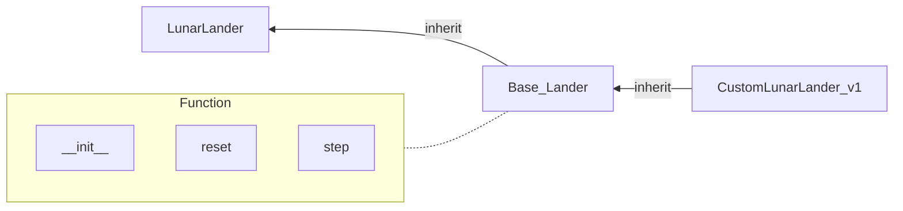

# LAB9

## LAB Class Diagram



## How To Run
First enter docker and setup the environment by following the commands below.
```
cd ~/oop_lab9
source Docker/docker_run.sh
source environment.sh
```
If you completed the missing code, you can run the custom lander by following the commands below.(make sure you're inside the docker that has setup the environment)
```
cd ~/oop_lab9/scripts
python3 play_lunarlander.py
```