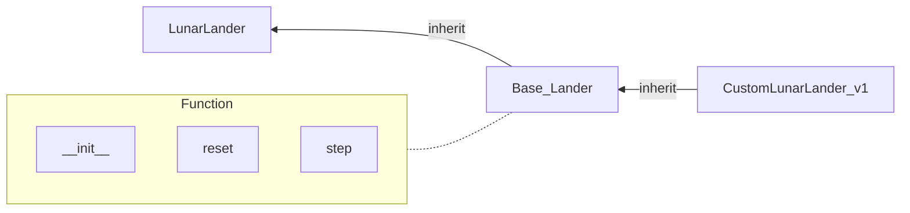
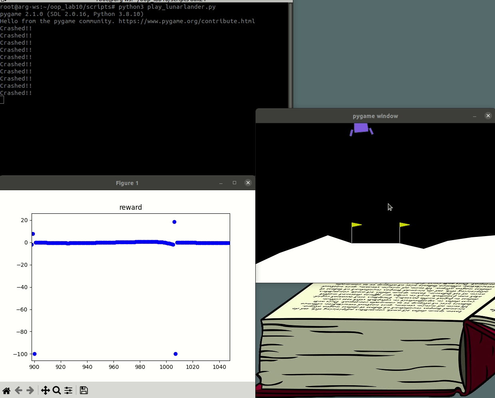

# LAB9

## Class Diagram



## LAB
### Task:
Add a fuel system into Custom Lander. (oop_lab9/custom_gymnasium/custom_gymnasium/envs/custom_lunarlander.py)
Add an input parameter to specify the total fuel when initializing Custom Lander.
Ensure that the lander's fuel decreases when its action is not zero.
Reset the fuel when Custom Lander is reset.

### Hint:
You'll need to use super() to call the parent class's constructor{init(), reset(), step()}.
Then you can integrate the fuel system into Custom Lander.
Please ensure that you specify the input and output requirements of each function.

### You can refer to the code from the file location below
oop_lab9/custom_gymnasium/custom_gymnasium/envs/box2d/lunar_lander.py
oop_lab9/custom_gymnasium/custom_gymnasium/envs/utils/base_lander.py
oop_lab9/custom_gymnasium/custom_gymnasium/envs/custom_lunarlander.py


## How To Run
First, enter the Docker and set up the environment by following the commands below.
```
cd ~/oop_lab9
source Docker/docker_run.sh
source environment.sh
```
If you've completed the missing code, you can run the custom lander by following the commands below. (Ensure that your terminal is inside the Docker environment where the setup has been completed.)
```
cd ~/oop_lab9/scripts
python3 play_lunarlander.py
```

## How should it looks like
