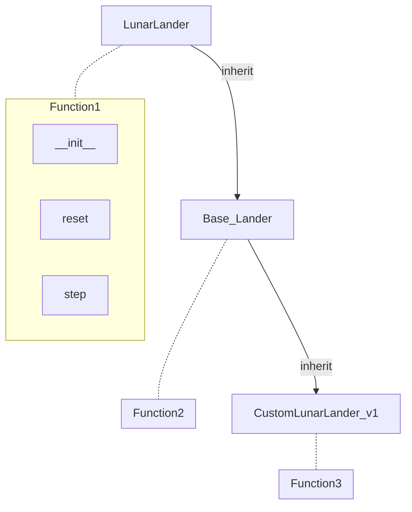

# LAB9

## Class Diagram

```mermaid
graph
    subgraph Function1
        __init__
        reset
        step
    end
    subgraph Function2
        __init__
        reset
        step
    end
    subgraph Function3
        __init__
        reset
        step
    end
    id1[LunarLander]--inherit-->id2[Base_Lander]--inherit-->id3[CustomLunarLander_v1]
    id1-.-Function1
    id2-.-Function2
    id3-.-Function3

```